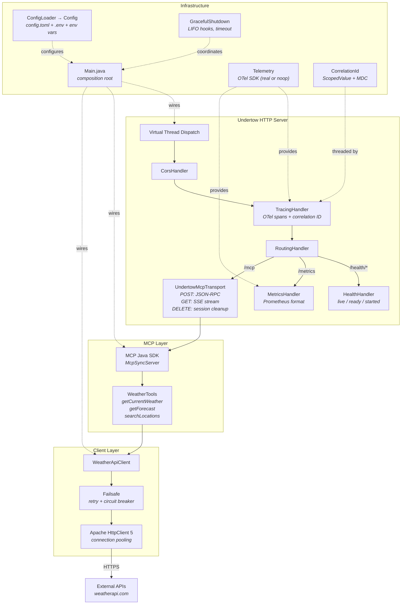
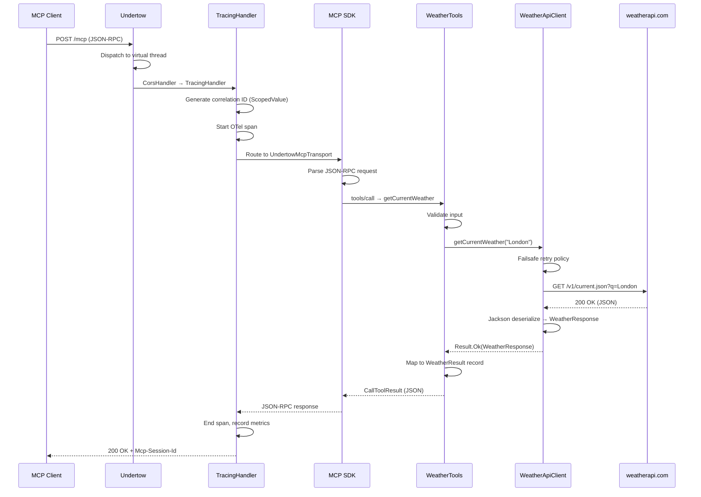

# Architecture

Lean, framework-free MCP server. Undertow + Jackson 3.1 + MCP Java SDK + Apache HttpClient 5 + Failsafe + OTel SDK + Log4j2. Constructor injection at a single composition root. No annotations, no classpath scanning, no magic.

## Component Diagram



## Request Lifecycle



## Package Structure

```
io.mcpbridge.mcp/
├── Main.java                         # Composition root — wires everything
├── config/
│   ├── Config.java                   # Typed config records (server, client, telemetry, etc.)
│   └── ConfigLoader.java            # Layered TOML + .env + env var loader
├── server/
│   ├── UndertowServer.java          # Server builder + handler chain
│   ├── UndertowMcpTransport.java    # Streamable HTTP transport for Undertow
│   ├── McpServerFactory.java        # MCP SDK wiring + tool registration
│   └── CorsHandler.java             # CORS middleware
├── tool/
│   └── WeatherTools.java            # Tool implementations (builder pattern, no annotations)
├── client/
│   ├── HttpClientFactory.java       # Apache HttpClient 5 builder from config
│   ├── WeatherApiClient.java        # Concrete client with Failsafe resilience
│   └── model/                       # Response DTOs (records)
├── common/
│   ├── Result.java                  # Sealed interface: Ok | Err
│   ├── Failure.java                 # Error representation
│   ├── ToolResult.java              # MCP response wrapper
│   └── TraceIdGen.java              # Fast hex trace ID generation
├── resilience/
│   └── Policies.java                # Failsafe retry + circuit breaker factories
├── observability/
│   ├── Telemetry.java               # OTel SDK setup (real or noop based on config)
│   ├── McpMetrics.java              # MCP-specific counters + histograms
│   ├── TracingHandler.java          # Undertow handler wrapper for server spans
│   ├── MetricsHandler.java          # GET /metrics → Prometheus format
│   └── CorrelationId.java           # ScopedValue + Log4j2 ThreadContext
├── health/
│   └── HealthHandler.java           # /health/live, /health/ready, /health/started
└── lifecycle/
    └── GracefulShutdown.java        # Shutdown hook coordination (LIFO, timeout)
```

## Key Design Decisions

| Decision | Choice | Rationale |
|---|---|---|
| HTTP server | Undertow | Fastest embedded Java server, composition-based handlers, virtual thread dispatch |
| JSON | Jackson 3.1 (`tools.jackson`) | MethodHandle-based, built-in java.time, immutable JsonMapper |
| MCP protocol | MCP Java SDK + custom Undertow transport | SDK handles protocol correctness; Reactor stays at transport boundary |
| HTTP client | Apache HttpClient 5 | Connection pooling, granular timeouts, response handlers |
| Resilience | Failsafe 3.3.2 | Zero transitive deps, builder API, virtual-thread safe |
| Observability | OTel SDK (manual) | Unified traces + metrics, conditional enable, Prometheus /metrics |
| Logging | Log4j2 + Disruptor | Garbage-free async logging |
| Config | TOML layered | `config.toml` → `.env` → env vars. Typed records via Jackson. |
| DI | Constructor injection | No framework. Composition root wires everything in Main.java. |
| Correlation | `ScopedValue` | Virtual-thread friendly, bounded lifetime, no ThreadLocal leak |

## Config Layering

```
env var (highest priority)
  ↓ overrides
.env file
  ↓ overrides
config.toml (lowest priority, defaults)
```

Secrets (API keys) go in `.env` or env vars. Everything else lives in `config.toml`.
